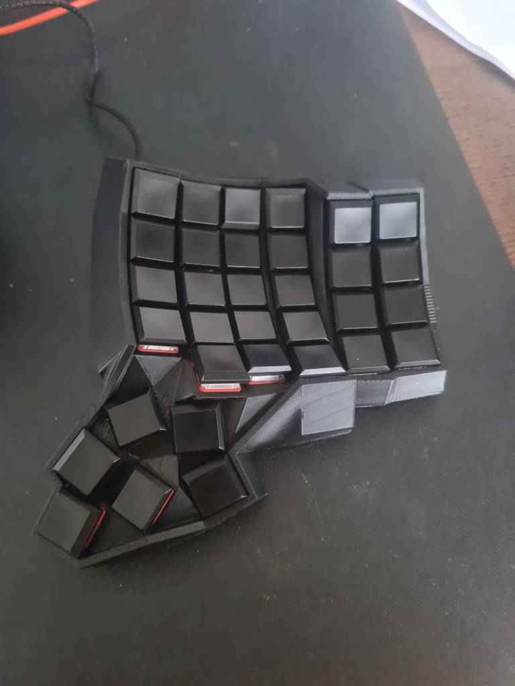

# lunactyl

This is my keyboard. It is a handwired dactyl based keyboard. The original thumbcluster is based on my previous experiments with the dactyl manuform and it was recreated using the [cosmos tool](https://ryanis.cool/cosmos/)

Version 1.0

## Features

1. 3 keys on the bottom row supporting alt, ctrl and shift modifiers.
2. 6 thumbcluster keys
3. choc v1 low profiles
4. handwired
5. split (trrs connector)

Total is 66 keys.

